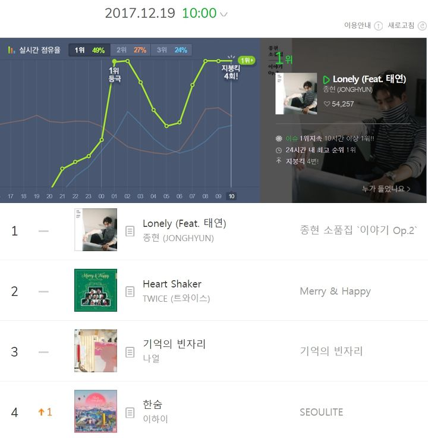

class: inverse, middle

## 목차 

#### 1. 배경 
#### 2. 크롤링
#### 3. 전처리 
#### 4. 역주행곡 분석
#### 5. 장르별 가사 분석
#### 6. 

```{r setup, include=FALSE }


library(tidyverse)
library(DT)

options(htmltools.dir.version = FALSE)
```


---

### 1. 배경


.pull-left[]

--


.pull-right[]


---
### 2. 전처리 

```{r preprocessing, include=FALSE}

raw= read.csv('melonchart_pre (ANSI).csv')

raw$weeknum=1
for (i in 1:(nrow(raw)-1)){
  if (raw$week[i]!=raw$week[i+1]){
    raw$weeknum[(i+1):nrow(raw)]=raw$weeknum[i]+1
  }
}
raw.pre=
raw%>% 
  select( weeknum, rank, title, artist )

```


```{r}
DT::datatable(
  head(raw.pre,100),
  fillContainer = FALSE, options = list(pageLength = 5))
```

---
### 4. 역주행곡 분석

```{r include=FALSE}
### rmse 뽑기
#id = raw %>%
#    select(id)
#rmse=
#  raw %>%
#  group_by(id,title)%>%
#  summarise(rmse=round(sqrt(mean(lm(rank~weeknum)$residuals^2)),2),count=sum(rank/rank))%>%
#  arrange(desc(rmse)) %>%
#  filter(count>10)


rmse = read.csv('rmse.csv')

```

```{r rmse}
DT::datatable(
  head(rmse,10),
  fillContainer = FALSE, options = list(pageLength = 5))
```
----


dfnoen
----


class: middle, center

## How?


---
```{r include=FALSE}

## function for making graphs
rp= function(id1){
  
  a=raw[which(raw$id==id1),]
  
  
  ggplot(data = a, aes(x = weeknum, y = rank)) + 
  geom_point(color='blue') +
  geom_smooth(method = "lm", se = FALSE,color = 'red')+
  ggtitle(paste(raw[(which(raw$id==id1)),]$title[1],'-',raw[(which(raw$id==id1)),]$artist[1])) +
  scale_y_continuous(trans = "reverse") 
  
}  

```

```{r rpplot}
rp(3973781)
```
---

rejififn 

---

Here is a shiny app [Example App](https://shiny.rstudio.com/gallery/kmeans-example.html)
---
##강수량과 역주행
---
### 


