class: inverse, middle

## 목차 

#### 1. 배경 
#### 2. 크롤링
#### 3. 전처리 
#### 4. 역주행곡 분석
#### 5. 가사 자연어 분석


```{r setup, include=FALSE }


library(tidyverse)
library(DT)

options(htmltools.dir.version = FALSE)
```


---

### 1. 배경


.pull-left[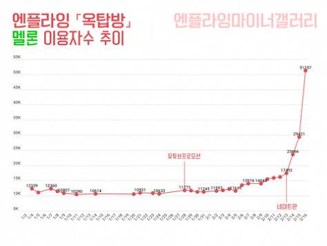]

--


.pull-right[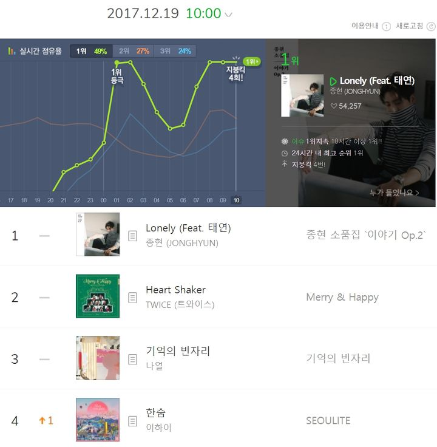]
---
class: center
#### 2. 크롤링

.image-70[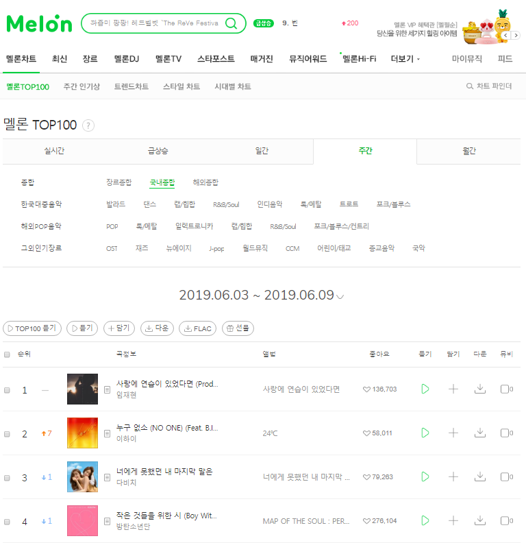]

---
### 3. 전처리 

```{r preprocessing, include=FALSE}

raw= read.csv('melonchart_pre (ANSI).csv')

raw$weeknum=1
for (i in 1:(nrow(raw)-1)){
  if (raw$week[i]!=raw$week[i+1]){
    raw$weeknum[(i+1):nrow(raw)]=raw$weeknum[i]+1
  }
}
raw.pre=
raw%>% 
  select( weeknum, rank, title, artist )

```


```{r}
DT::datatable(
  head(raw.pre,100),
  fillContainer = FALSE, options = list(pageLength = 5))
```

---
#### 4. 역주행곡 분석

```{r include=FALSE}
### rmse 뽑기
#id = raw %>%
#    select(id)
#rmse=
#  raw %>%
#  group_by(id,title)%>%
#  summarise(rmse=round(sqrt(mean(lm(rank~weeknum)$residuals^2)),2),count=sum(rank/rank))%>%
#  arrange(desc(rmse)) %>%
#  filter(count>10)


rmse = read.csv('rmse.csv')

```

```{r rmse}
DT::datatable(
  head(rmse,10),
  fillContainer = FALSE, options = list(pageLength = 5))
```
---


class: middle, center

## How?

---
```{r include=FALSE}

## function for making graphs
rp= function(id1){
  
  a=raw[which(raw$id==id1),]
  
  
  ggplot(data = a, aes(x = weeknum, y = rank)) + 
  geom_point(color='blue') +
  geom_smooth(method = "lm", se = FALSE,color = 'red')+
  ggtitle(paste(raw[(which(raw$id==id1)),]$title[1],'-',raw[(which(raw$id==id1)),]$artist[1])) +
  scale_y_continuous(trans = "reverse") 
}


rp2= function(id1){
  
  a=raw[which(raw$id==id1),]


  ggplot(data = a, aes(x = weeknum, y = rank)) + 
  geom_point(color='blue') +
  geom_smooth(method = "lm", se = FALSE,color = 'red')+
  ggtitle(paste(raw[(which(raw$id==id1)),]$title[1],'-',raw[(which(raw$id==id1)),]$artist[1])) +
  scale_y_continuous(trans = "reverse") +
  geom_line(data=a,aes(x=weeknum,y=100-pre_sum/10),color='purple',lwd=1)
} 

```
```{r}
rp(30120986)
```
---
```{r}
rp(3753304)
```

---

### 역주행에 영향을 주는 요소들은?

<br/>
####  방송 출연
<br/>
####  계절
<br/>
####  사회적 이슈
<br/>
####  아이돌 컴백
<br/>
####  강수량

---
#### 방송 출연  


```{r rpplot}
rp(3973781)
```
---
#### 계절 
```{r}
rp(3753304)
```

---
#### 사회적 이슈 

```{r}
rp(30383758)
```
---
#### 아이돌 컴백
```{r}
rp(30029173)
```
---
#### 기상청 - 기상자료개방포털
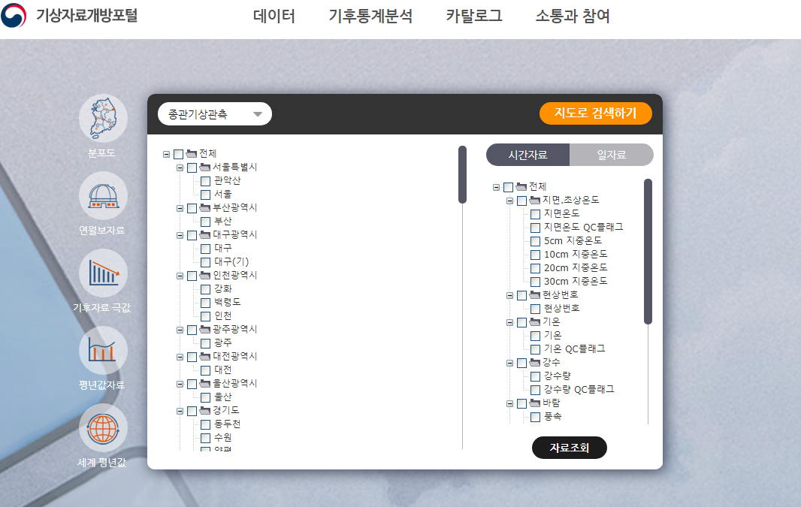
출처:https://data.kma.go.kr/cmmn/main.do
---
```{r include=FALSE}
seoul=read.csv('Seoul.csv')
```

```{r}
DT::datatable(
  head(seoul,200),
  fillContainer = FALSE, options = list(pageLength = 5))
```
---
#### 강수량과 역주행
```{r}
rp2(30492279)
```


---

### 5. 가사 자연어 분석

<br/>
<br/>
####- 장르별 단어 빈도 분석
<br/>
####- 장르별 Word Cloud
<br/>
####- 역주행곡 co-occurrence 네트워크 분석

---
### 장르별 단어 빈도 분석 (발라드, 댄스)

.pull-left[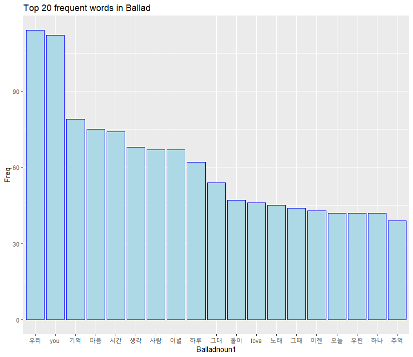]

--


.pull-right[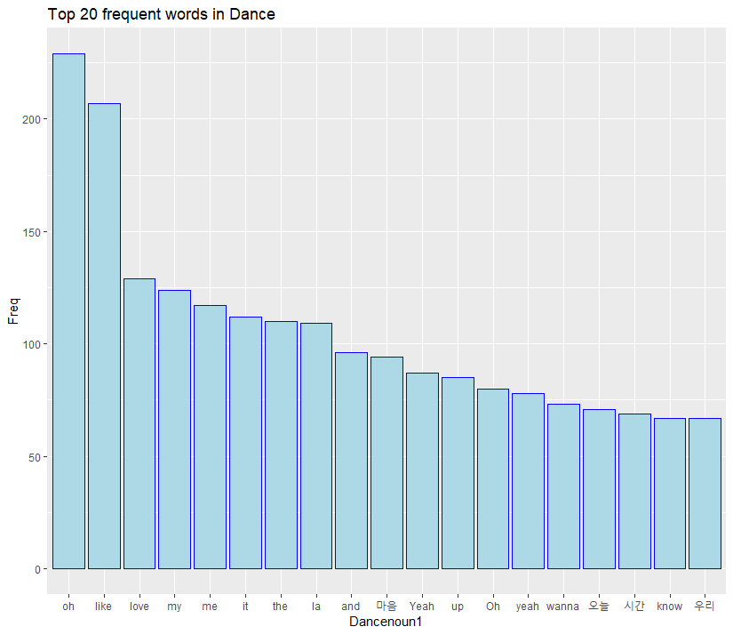]


---
### 장르별 단어 빈도 분석 (R&B, 힙합)

.pull-left[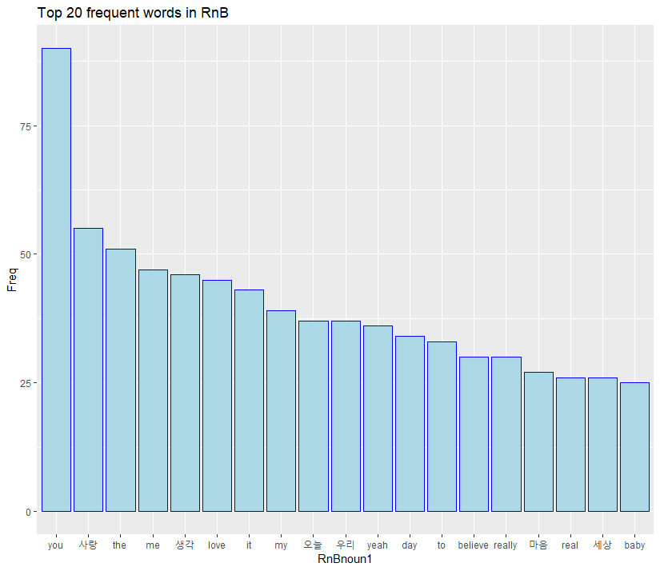]

--


.pull-right[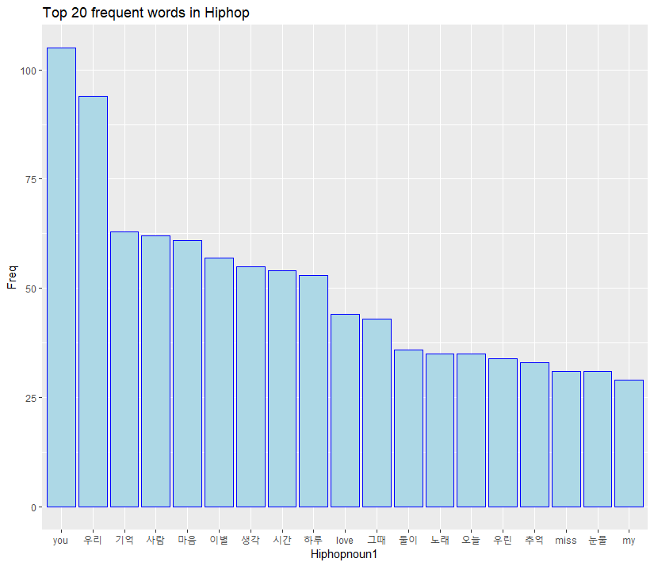]

---

### 장르별 단어 빈도 분석 (락, 드라마)

.pull-left[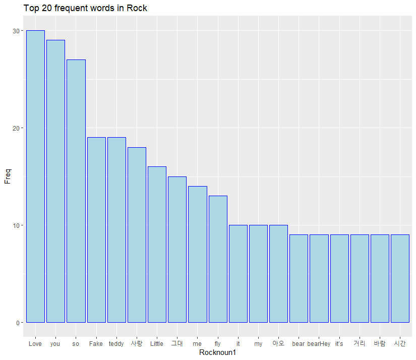]

--


.pull-right[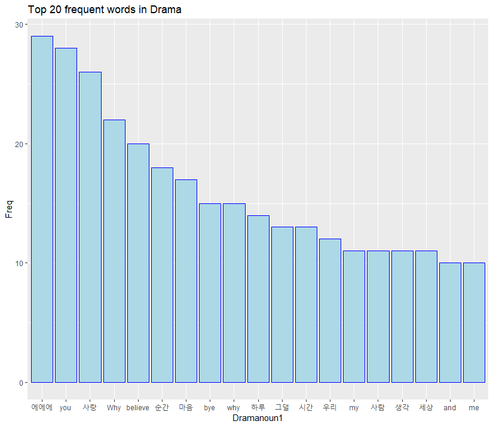]

---

### 장르별 Word cloud (발라드)


---
### 장르별 Word cloud (댄스)


---
### 장르별 Word cloud (드라마)


---
### 장르별 Word cloud (힙합)


---
class: center
### 2018년 역주행곡 Co-occurrence 네트워크 분석
.image-80[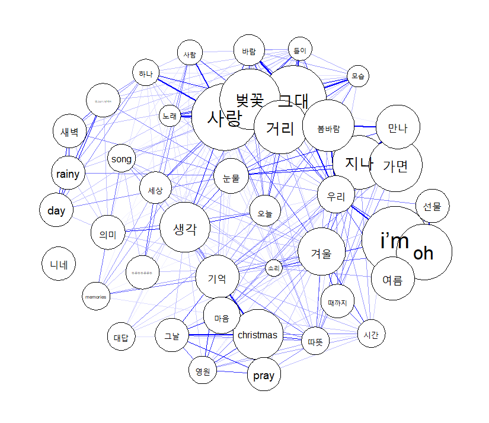]

---
class: inverse, middle, center

##감사합니다


